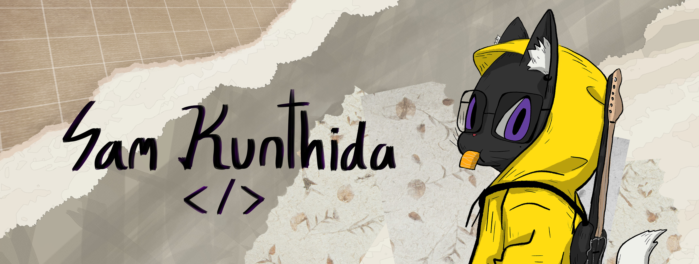

# Sam Kunthida 👾 
**`Developer | UX/UI Designer`**

📮
 <a href="mailto:kunthidakhlongkhlaew@gmail.com" target="_blank">kunthidakhlongkhlaew@gmail.com</a>

## About Me
I'm a mobile app developer student passionate about becoming an indie Unity game developer. I specialize in **mobile app development** and **UX/UI design**, with a interest in **game development**. I really enjoy building creative solutions, from ideation and planning to designing user experiences that engage deeply.

I’m especially passionate about game development and have a huge desire to craft games that capture someone's heart with my story, gameplay, and design details. My goal is to contribute meaningfully to the game industry by blending art, design, and technology together.

## Languages & Tools
    

## 🌐 Socials:
  

<!--
+ ReactJS
+ HTML, CSS, JS
+ C# Unity

📃 My Resume
<a href="..." rel="nofollow" target="_blank">Click Here</a>

-->
